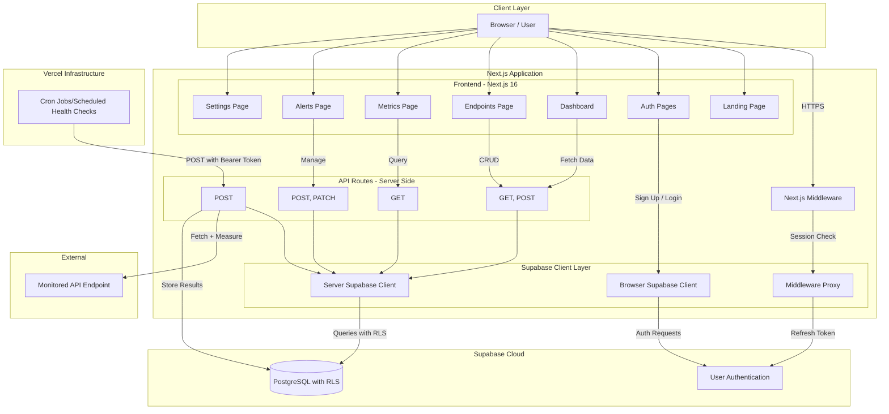
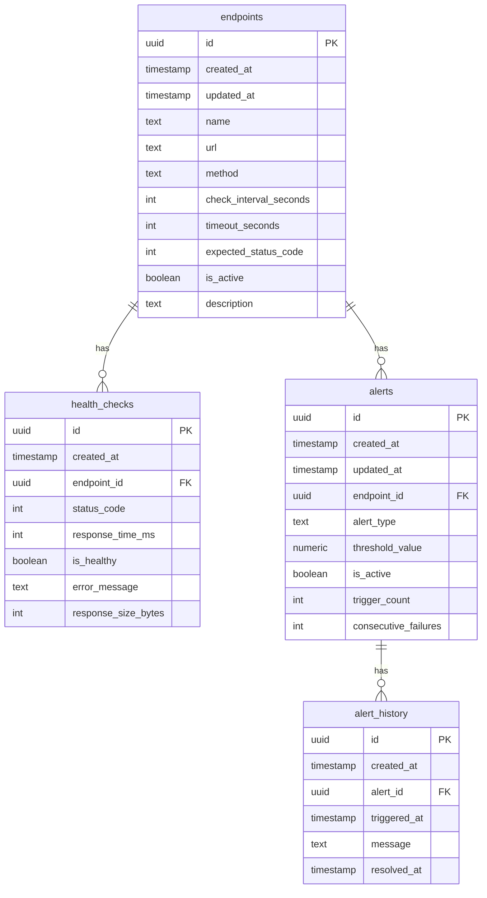
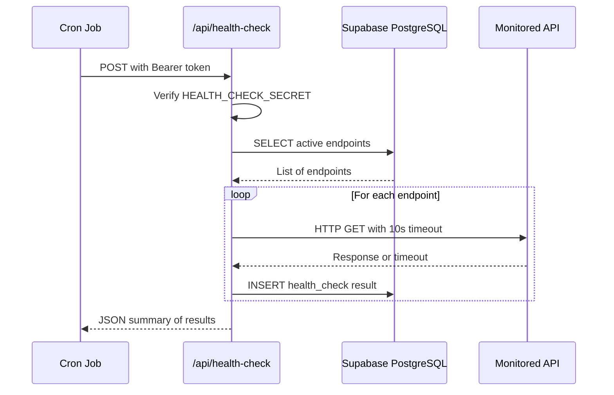
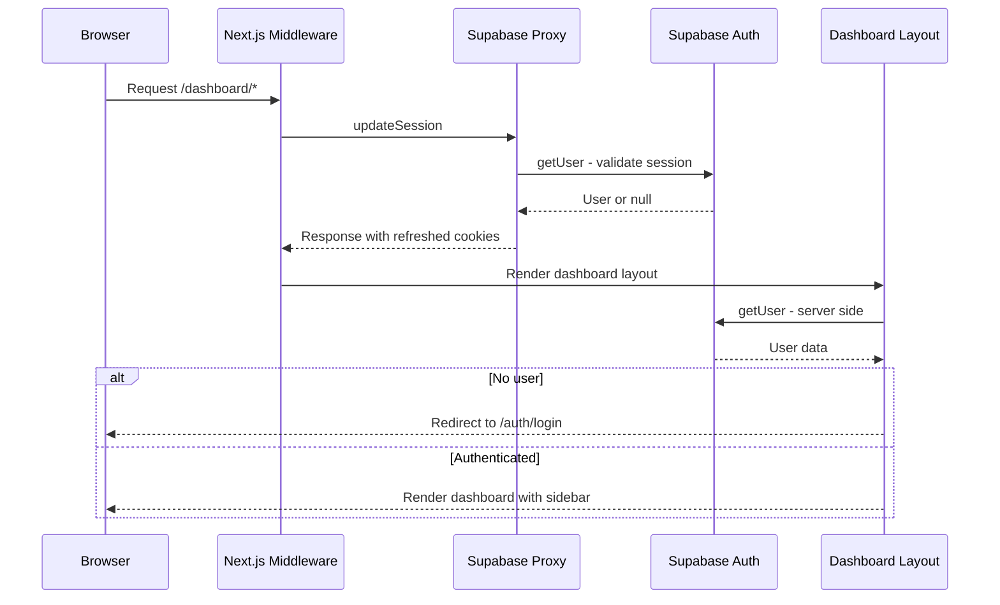
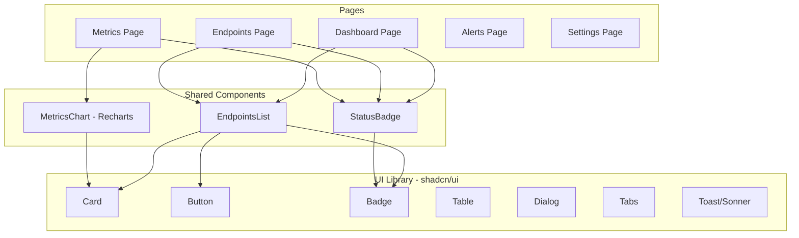

# API Monitor - System Architecture

## High-Level Architecture Diagram

## Database Schema - Entity Relationship Diagram

## Request Flow - Health Check Cycle

## Authentication Flow

## Component Architecture

## Technology Stack Summary

| Layer                  | Technology                                  |
| ---------------------- | ------------------------------------------- |
| **Frontend Framework** | Next.js 16, React 19, TypeScript            |
| **UI Components**      | shadcn/ui, Tailwind CSS                     |
| **Charts**             | Recharts                                    |
| **Database**           | Supabase PostgreSQL with Row Level Security |
| **Authentication**     | Supabase Auth via `@supabase/ssr`           |
| **Hosting**            | Vercel with Cron Jobs                       |
| **Package Manager**    | pnpm                                        |

## Key Architectural Decisions

1. **Server-side Supabase clients** are created per-request in [`createClient()`](lib/supabase/server.ts:9) to support Vercel Fluid Compute — no global singletons.
2. **Middleware** at [`middleware.ts`](middleware.ts:4) refreshes auth sessions on every request via the [`updateSession()`](lib/supabase/proxy.ts:4) proxy.
3. **Health checks** are triggered externally via [`POST /api/health-check`](app/api/health-check/route.ts:40) secured by a `HEALTH_CHECK_SECRET` bearer token, designed for Vercel Cron invocation.
4. **RLS policies** in [`001_create_monitoring_schema.sql`](scripts/001_create_monitoring_schema.sql:59) are currently set to public access for all tables — intended to be tightened for production.
5. **Dashboard layout** at [`app/dashboard/layout.tsx`](app/dashboard/layout.tsx:8) performs server-side auth checks and redirects unauthenticated users.
